# String Method in Collective Variables -- An Implementation in NAMD v 2.11 using CFACV

This README resides in the alad-string-method subdirectory of github.com/cameronabrams/cfacv/examples/.  The purpose of the readme is to provide an explanation of how to run a string method in collective variables (SMCV) simulation using our CFACV implementation.  The example is a solvated molecule of alanine dipeptide under the CHARMM22 force-field and TIP3P water.  

> **Note:**  It is probably a good idea to try out the earlier CFACV tutorials first:

> - alad-fixed-phi-psi/: MD with harmonic restraints on  and 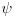 angles
> - alad-tamd/: TAMD where 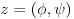
> - alad-single-sweep/: single-sweep reconstruction of the free-energy surface 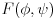

It is also assumed the reader has a good working knowledge of MD simulations in general and NAMD in particular.  Because this implementation is based on NAMD's replica exchange feature, it also requires a NAMD binary with MPI enabled.

## Background

The current implementation of SMCV is *almost* what is described in Maragliano and Vanden-Eijnden, "On-the-fly string method for minimum free energy paths calculation", *Chemical Physics Letters* 2007;**446**:182-190.  (I'll get to the meaning of "almost" in a bit).  

The objective of a SMCV calculation is to identify a minimum free-energy pathway (MFEP) through a collective variable (CV) space chosen by us.  The multidimensional variable  represents a location in CV space, and one can map an all-atom (3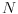-dimensional, where  is the number of atoms) configuration 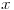 to a point in CV space using the multidimensional mapping function 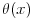.  (For alanine dipeptide, the CV space most commonly explored is the 2-D space spanned by the backbone dihedral angles  and .)  An MFEP connects two separated, local minima with a curve 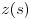 that satisfies 

 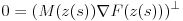

That is, the MFEP is that curve  whose perpendicular components of the metric-tensor-rotated free-energy gradients locally perpendicular to the curve are zero.  (The metric tensor is required because the mapping functions can in general be curvilinear functions of atomic configuration.) This curve can (again, almost) be found by first setting up an initial curve arbitrarily, and then solving the differential equation

 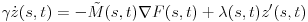

Here, 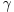 is a friction that we can choose, and the second term on the RHS represents reparameterization of the curve.  It's clear that, in general, one needs to know the tensor function 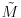 and vector function 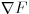 in order to solve this equation, but in the context of a CV space  these functions are statistical-mechanical averages over underlying configuration space ; specifically,

 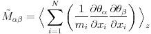

where 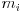 is the mass of configurational variable 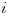, and

 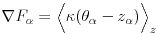

Here, the  subscripts on the angle brackets denote that one needs to compute these locally in CV space.  Since these are ensemble averages, we of course run MD on an atomistic system to compute them, but to keep them local, we run _restrained_ MD using a harmonic external potential 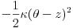. Of course, one could _precompute_  and  along finite but uniformly spaced set of discrete points spanning CV space, and then find an MFEP by direct explicit integration; however, this is unpractical in most CV spaces.  

In practice, SMCV represents  as a set of 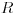 discrete points 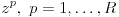, each of which is termed an "image", and which together constitute the "string" representation of the curve .  We use a single companion restrained all-atom MD system for each image 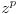 to compute 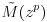 and 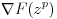.  In traditional SMCV, one should run long MD at fixed  to compute these, and then a finite update step that solves the string update is applied to give the next set of image  values, and the cycle repeats.  In the ``on-the-fly'' variant, the string updates are chosen to be very small (by setting  to be large) so that updates of  together with  and  are computed in lockstep.  (In the implementation here, the number of MD timesteps per string image update for this averaging can be set as low as 1 to implement the OTF version.)  In either case, the MFEP is located when the image updates no longer appreciably move the string.  So, think of a typical SMCV simulation as something like replica-exchange, except that as the replicas are evolving, their "mapping points" in CV-space are moving as a string toward an MFEP.

Now, about the "almost".  As just mentioned, for each image, this implementation uses a *single* restrained MD simulation (of one or more timesteps) to compute both the metric tensor estimate 
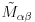 and the free-energy gradient estimate 
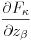.  Strictly speaking, the two must be statistically independent for the SMCV to compute the true MFEP through CV space.  Since here we compute both in the *same* atomistic system, this method computes *not* the exact MFEP, but instead the curve that satisfies eqn. 28 in appendix of the 2007 paper.  Note that this curve *is* the MFEP if the metric tensor has no off-diagonal elements, which is the case when, for example, the collective variable mapping functions are mutually-exclusive centers of mass.  A future version of this release will use *separate* atomistic simulations to compute each of  and .

## Instructions

> **The short version:**
> 1. (one time only) download the CFACV repository and compile `cfacv.so`; note that CFACV has been updated with this release of SMCV, so you should just recompile it.
> 2. For a given SMCV simulation:
>    a. define CV space and set up initial images;
>    b. make the output directory tree;
>    c. choose values of $\kappa$ and $\gamma$, and the number of timesteps between string updates (`steps_per_run`), and edit the appropriate input files;
>    d. create output directory structure, launch SMCV, and monitor for convergence.
>    e. if desired, run a set of restrained MD simulations on the final string to compute the free-energy profile along the string.

### The Long Version:
This follows the basic structure of the NAMD version of replica exchange, on which I based this implementation of SMCV.  File names appear in **bold**, and all directories in `monospace` refer to subdirectories of the CFACV repository.  

#### Get the latest CFACV implementation

Clone this repository to your local machine or whatever machine you'll be running on.  Change directory to `src` and issue the command

`make all`

#### Setting up and running the example SMCV calculation

Now go to the `examples/alad-string-method` directory.  The file **job0.conf** is the master NAMD config file in the command line of the NAMD invocation used to start a string method calculation.  For _this_ calculation, which is able to be run on a single workstation, I provide a bash script **runstring.sh** that shows how to invoke a SMCV calculation.  (**runstring.sh** should be easily adaptable into a PBS or SLURM batch submission script.)  The "0" indicates the first in what could be a sequential set of restarts; i.e., a **job1.conf** is the file one sends to NAMD to restart from the latest checkpoint of the simulation run from **job0.conf**.

**job0.conf**  sources **alad_stringmethod.conf**, which sets parameters for the specific calculation, and then sources the general **stringmethod.tcl** (located in the `tcl/` directory of the CFACV repository).    The NAMD invocation in **runstring.sh** shows how to specify the number of images, and the total number of processors to use (which must be a multiple of the number of images).  It is envisioned that one should only need to change specifics in a system-specific **stringmethod.conf** file and **job0.conf** file to start a new SMCV calculation.

For this tutorial, **alad_stringmethod.conf** is fully commented and should be read carefully.  It identifies the base NAMD configuration file **alad_base.namd** that contains MD parameters common to all simulations, including the commands that enable the CFACV `tclforces()` module.  One of _those_ parameters is the spring constant 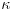.

Based on what is in **alad_stringmethod.conf**, the input files for each image's MD simulation (including the .coor, .vel, and .xsc files) follow a filename convention of the form **go.job0.#.coor**, where "#" is the integer image number.  In this tutorial, we'll work with 24 images, so the "#" is replaced with integers 0...23.  It is important to realize that, in this tutorial, these image-specific input files are generated by running a set of sequential restrained MD simulations.  (In general, there may be many ways to generate an initial string; this is merely one way.)  The shell script **mkinitimages.sh** is provided here to show how these image-specific inputs are generated, beginning from the files **alad_wb.psf** and **alad_wb.pdb**, along with inputs **go_md.coor**, **go_md.vel**, and **go_md.xsc** taken from a long, unrestrained MD simulation.  **mkinitimages.sh** is also well-commented and should be read carefully.  It is what allows one to choose the placement of the initial string in 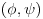-space and how many images are desired.  In this case, you'll see that we have chosen to begin the inital string (i.e., place image 0) at 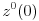 = (-5, 2.2649) radians, and to end the initial string (i.e., place image 1) at 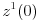 = (-0.25, -1.3) radians.  The interior images are equally spaced along the line connecting these two points.  One can generate a new set of initial image inputs simply by issuing the command:

`./mkinitimages.sh > init.log`

This command can be monitored (as you might suspect) by

`tail -f init.log`

**mkinitimages.sh** runs a bunch of sequential NAMD simulations to set up the images.  Note that here is the first place you encounter the input files **cv.inp** and **label.pdb**.  These are **very, very important files**, as you should have learned in the very first CFACV tutorial.  Briefly, **label.pdb** is a full PDB file congruent to the system that merely serves to label atoms as belonging either to _no_ group ($\beta$ = 0) or to a specified group ($\beta$ = 1,2,$\dots$).  The center of mass of group $n$ as defined by **label.pdb** is referred to as "center" $(n-1)$ in **cv.inp**.  In this tutorial, we define the two CV's as the $\phi$ and $\psi$ dihedrals; if you examine **label.pdb** and **cv.inp** carefully, you should be able to confirm this for yourself.  Finally, **mkinitimages.sh** generates a separate file for each image with the name **restr_init_#-1.inp**, where the **#**  is replaced by the image number from 0 to 23.  These files contain the value of the point in CV space each image is initially tethered to.  These are also read in by the SMCV calculation at the beginning.

**alad_stringmethod.conf** also stipulates that image simulation outputs are organized into directories of naming format `output/#/`, where again the `#` is the image number.  To easily generate an empty set of output directories, use the NAMD-provided script **make_output_directories.sh** via

`../../sbin/make_output_directories.sh output 24`

where the first argument is the base subdirectory name for the output and the second is the number of subdirectories of _that_ directory to make, one for each image.

One more thing in the **stringmethod.conf** file is the stipulation of the variables `steps_per_run`, `num_runs`, and `runs_per_frame`.  A "run" in this context is a length of sequential MD timesteps between updates of the string image locations; in true "on-the-fly* SMCV, this is ONE.  The number of runs (`num_runs`) is just how many string method updates one wants to perform.  The set of runs is broken up arbitrarily into sequential sets called "frames" of size `runs_per_frame` runs, and by default, information about current positions, gradients, and values of the metric tensor are output at the end of each frame.  Restart sets are also generated every few frames, as stipulated by the `frames_per_restart` variable.

#### Running the SMCV simulation

Taking stock:  You are ready to launch the SMCV simulation for a system of $N$ images provided you have a **stringmethod.conf** file (here, this is **alad_stringmethod.conf**), a **job0.conf** master config file, the **go.job0.0.coor**, **go.job0.1.coor**, **go.job0.2.coor**, etc. (same for **.vel** And **.xsc**) input files, the **restr_init_#-1.inp** inputs, a **base.namd** base config file (here, **alad_base.namd**), any parameter files your system requires, and the output directory structure.  Issue the command

`./runstring.sh > run.log &`

You can monitor the progress by 

`tail -f output/0/alad_sm.job0.0.history`

This history file for replica `0` contains three types of output:  gradients, metric tensors, and current image locations in CV space.  It generates one line of output of each type for each image once per frame.   If there are no errors, the simulation will run for a number of MD timesteps given by the product of `steps_per_run` and `num_runs` in the **alad_stringmethod.conf** input file.  So, say for example you have a system of 24 images with 1 step per run and 20,000 runs and 50 runs per frame, you would expect 400 * 3 * 24 = 28,800 lines of output in `output/0/alad_sm.job0.0.history`.  

#### Monitoring for Convergence

The script **measurermsd.sh** in the `sbin/` directory provides the capability of computing the average "distance" of the string from a reference string, according to 

$$
{\rm RMSD}(t) = \sqrt{\frac{1}{R}\sum_{i=1}^R |z^i(t) - z^i_0|^2}
$$

where $z^i(t)$ is the instaneous location of image $i$ in CV space at time $t$, $z^i_0$ is a reference position of image $i$ (which here is the position after the **latest** update), and as before $R$ is the number of images.  Anytime during the run, invoke this as

`../../sbin/measurermsd.sh -smh output/0/alad_sm.job0.0.history -ni 24 > rmsd.0.out &`

It needs the name of the string method history file to read Z values from and the number of images.  It will also read the **cv.inp** file to determine the dimensionality of CV space.  It will generate an output file in which each line has the frame number and the RMSD at that point in time, relative to the latest string.  

#### Computing the free-energy profile along the string

Computing the free energy profile along the string requires running several restrained MD simulations and tallying the free energy gradients and metric tensors.  This is handled by the script **measurefep.sh** in the `sbin/` directory.  Note that in order to run this script, you need to compile two helper C programs: `src/ForcesFromLog.c` and `src/FEPFromForces.c`.  If you issued a `make all` in the `src/` directory, these should have been compiled and their executables should exist in the `bin/` directory.   **measurefep.sh** is extensively commented and should be read carefully.   The default values for the variables it needs conform to the alanine dipeptide tutorial, so just issuing it as `../../sbin/measurefep.sh` should launch the MD simulations in series, resulting finally in the file **fep.out**.

## Conclusion

That is the end of the tutorial -- but look for more updates in the future.

> Written with [StackEdit](https://stackedit.io/).
